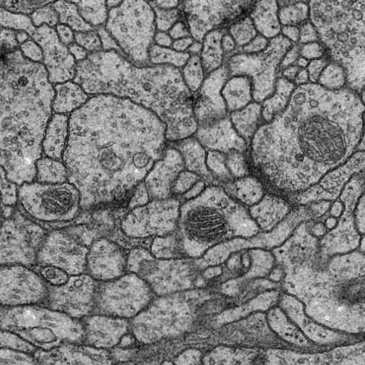
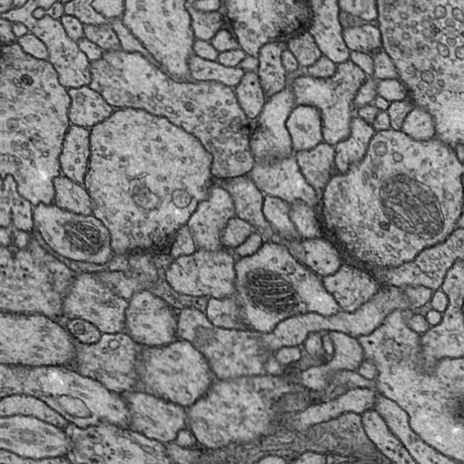
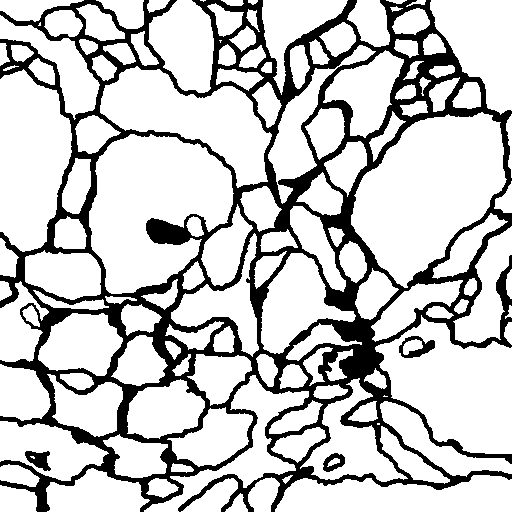
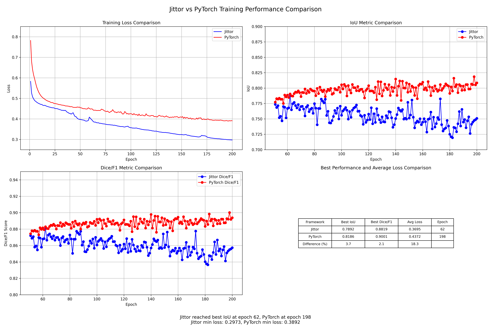
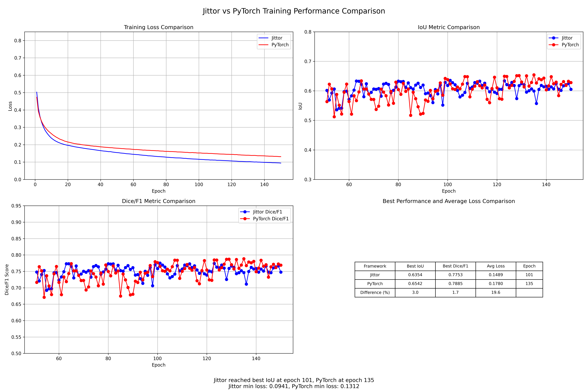
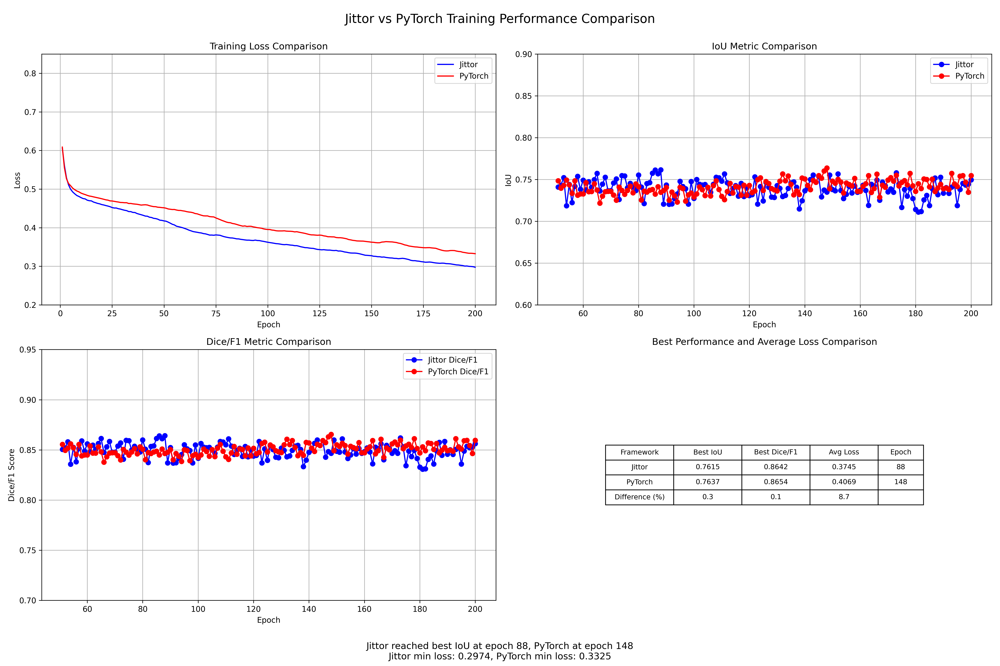
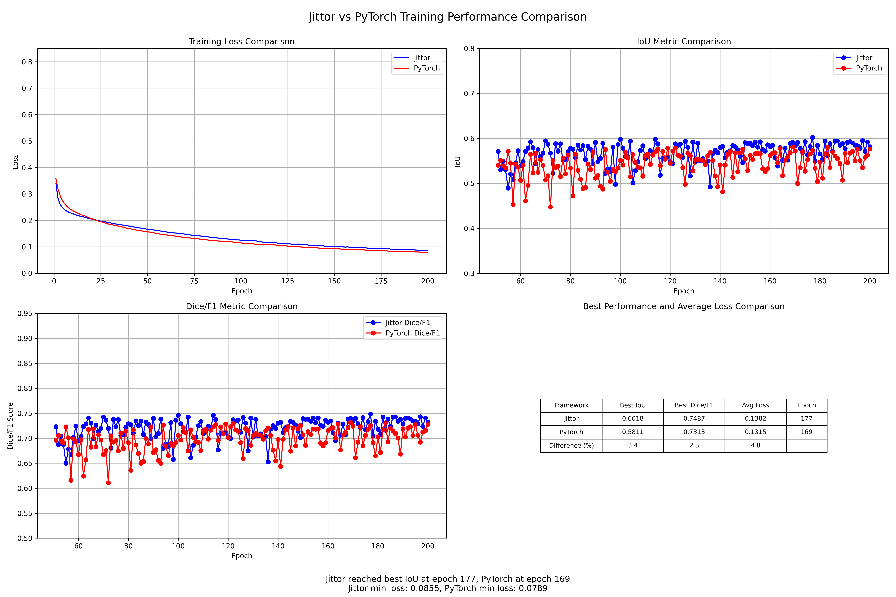

# Jittor复现Unet论文 

    本项目提供了基于Jittor框架的Unet论文实现，并与PyTorch版本进行了详细的对齐验证。
    我使用的Jittor版本是1.3.1.18，这个版本在windows下比较稳定。

数据集我选择的是ISBC2012和consep数据集，存放在data下。因为我使用的是Unet论文中的Vaild卷积，所以输出尺寸会小于输入尺寸， 我这个框架处理是用来处理512尺寸的，
所以我把consep(1000尺寸)中的图片都分割为了512*512的大小。

数据处理部分，复现了Unet论文中的弹性形变，可见DataAugmentation.py。
模型部分，除了Unet，还复现了U2net和U2netS，由于资源有限，我使用了Unet和U2netS进行的实验，大家有兴趣也可以尝试U2net。
损失函数部分，复现了Unet论文中的权重图(类别权重+边界强化权重)，可见Loss.py，运行的时候会事先把标签的权重图保存到./weight_maps下，避免重复运算。

另外，论文中的重铺平叠(overlap)策略、高动量(0.99)、编码器末端加入dropout层、网络初始化等都进行了复现。
项目结构中的checkpoints_consep、checkpoints_ISBC、logs_consep、logs_ISBC、results_consep、results_ISBC文件夹都是我自己整理的，
程序实际运行并不会生成这些文件夹，会生成checkpoints、DataTxt、logs、results、weight_maps文件夹。

    下面只展示了jittor框架下的代码，pytorch框架下的代码逻辑和运行方法和jittor一样。
    pytorch框架链接:https://github.com/xyt732/pytorch-Unet
## 项目结构

```
Unet-jittor/
├── checkpoints_consep/     # ConsEP数据集模型检查点  里面有Unet和U2netS的模型检查点
├── checkpoints_ISBC/       # ISBC数据集模型检查点    里面有Unet和U2netS的模型检查点
├── data/                   # 数据目录              包括ISBC2012和consep
├── logs_consep/           # ConsEP训练日志         里面有Unet和U2netS的实验log
├── logs_ISBC/             # ISBC训练日志           里面有Unet和U2netS的实验log
├── PNG/                   # 论文中的图片            方便构建模型
├── results_consep/        # ConsEP结果            里面有Unet和U2netS的测试集的最好结果
├── results_ISBC/          # ISBC结果              里面有Unet和U2netS的测试集的最好结果
├── DataAugmentation.py    # 数据增强模块            先运行这个文件对data中的数据进行增强
├── DataLoader.py          # 数据加载器
├── jittorsummary.py       # 模型参数打印            jittor官方提供的,查看模型参数的工具
├── Loss.py                # 损失函数定义            可以运行里面的主函数查看效果，也可以在程序运行起来后生成的./weight_maps下查看效果
├── Main.py                # 主训练脚本              运行完DataAugmentation.py运行这个文件启动训练和测试
├── MakeTxt.py             # 生成数据列表            生成./DataTxt，存放训练和测试数据的路径
├── MirrorPadding.py       # 镜像填充实现            Unet论文中的镜像填充,也可以运行里面的主函数查看效果
├── Model.py               # 模型定义               包括Unet、U2net、U2netS
├── Process.py             # 训练和测试过程           通过Main.py启动             
├── requirements.txt       # 依赖包列表
└── README.md              # 本文档
```

## 环境配置

### 我的配置
- Python: 3.9.21
- CUDA: 12.8
- GPU: Laptop3060
- 内存: 16G
- CPU: i7-12700H


### jittor环境配置 requirements.txt  
```
jittor==1.3.1.18
matplotlib==3.10.3
numpy==2.3.0
Pillow==11.2.1
scipy==1.15.3
skimage==0.0
tqdm==4.67.1
```


## 数据准备脚本

### 数据集结构
```
data/
├── ConsEP/
│   ├── test/
│   │   ├── imgs/
│   │   └── labels/
│   └── train/
│       ├── imgs/
│       └── labels/
└── ISBC2012/
    ├── test/
    │   ├── imgs/
    │   └── labels/
    └── train/
        ├── imgs/
        └── labels/
```

### 数据增强(弹性增强)
```bash
# 具体参数含义可以看代码中的注释
python DataAugmentation.py \
    --img_path "./data/ISBC2012/train/imgs" \
    --mask_path "./data/ISBC2012/train/labels" \
    --sum 2 \
    --alpha_lv 2.0 \
    --sigma_lv 0.08 \
    --alpha_affine_lv 0.08
```

## 训练和测试脚本
在我的项目中，训练和测试的函数都在Process.py中，通过Main.py启动，
Total_epochs-总共有几个训练epoch，
Val_epochs-从第几个epoch开始测试(计算得分并保留最佳模型)
### 命令
```bash
# 具体参数含义可以看代码中的注释
python Main.py \
    --Data_directory "./data/ISBC2012" \
    --Datatxt_directory "./DataTxt" \
    --Log_directory "./logs" \
    --Checkpoint_directory "./checkpoints" \
    --Result_directory "./results" \
    --is_grayscale True \
    --n_channels 1 \
    --n_classes 2 \
    --Total_epochs 200 \
    --Val_epochs 50 \
    --Batch_size 1 \
    --bilinear True \
    --dropout_probs 0.2 0.3 0.4 0.5 \
    --Learning_rate 0.00001 \
    --Loss_w0 10 \
    --Loss_sigma 5 \
    --mode "Unet"


```

## 弹性形变复现 左边是原图 右边是变换后的图片

 


## 损失函数复现 左边是标签 右边是权重图(颜色越深权重越高)

 

## 训练日志分析

### 训练过程监控
模型训练过程中的关键指标记录在日志文件中，模型保存在./checkpoints下，最佳测试结果保存在./results下，权重图保存在./weight_maps下。

```、logs_consep、logs_ISBC、results_consep、results_ISBC
查看训练日志，可以直接前往logs_consep、logs_ISBC文件夹查看
查看模型，可以直接前往checkpoints_consep、checkpoints_ISBC文件夹查看(由于文件较大，保存的模型没有上传)
查看结果，可以直接前往results_consep、results_ISBC文件夹查看


```

## 实验log对比

#### Unet---ISBC2012数据集




#### Unet---consep数据集




#### U2netS---ISBC2012数据集




#### U2netS---consep数据集



### 指标的差距大概在3%以内，基本一样，Loss差距大可能是因为神经网络初始化的随机性


## 性能log对比


#### Unet模型参数对比
```
# Jittor框架下Unet参数统计
17,266,306 total parameters.
17,266,306 training parameters.

# PyTorch框架下Unet参数统计  
17,266,306 total parameters.
17,266,306 training parameters.

# 参数数量一致
```

#### U2net模型参数对比
```
# Jittor框架下U2net参数统计
44,052,518 total parameters.
44,023,718 training parameters.

# PyTorch框架下U2net参数统计  
44,023,718 total parameters.
44,023,718 training parameters.

# 参数数量基本一致
```

#### U2netS模型参数对比
```
# Jittor框架下U2netS参数统计
1,140,358 total parameters.
1,134,662 training parameters.

# PyTorch框架下U2netS参数统计  
1,134,662 total parameters.
1,134,662 training parameters.

# 参数数量基本一致
```
### jittor框架下和pytorch框架下的训练参数一致。总参数有些微差异的原因可能是 框架的参数统计方法的不同


### 训练速度对比 ----- 硬件配置: RTX Laptop 3060, Batch_size=1 因为我的显存只有6G


#### Unet---ISBC2012数据集:
```
Jittor训练速度:  
    平均epoch_time: 43.1816秒
    平均throughput: 2.0845 images/sec
PyTorch训练速度: 
    平均epoch_time: 41.8395 秒
    平均throughput: 2.1573 images/sec
```

#### Unet---consep数据集:
```
Jittor训练速度:
    平均epoch_time: 54.6879 秒
    平均throughput: 1.9751 images/sec
PyTorch训练速度: 
    平均epoch_time: 47.9449 秒
    平均throughput: 2.2528 images/sec
```

#### U2netS---ISBC2012数据集:
```
Jittor训练速度: 
    平均epoch_time: 23.0565 秒
    平均throughput: 3.9036 images/sec
PyTorch训练速度: 
    平均epoch_time: 16.3313 秒
    平均throughput: 5.5119 images/sec
```

#### U2netS---consep数据集:
```
Jittor训练速度: 
    平均epoch_time: 26.4184 秒
    平均throughput: 4.0882 images/sec
PyTorch训练速度:
    平均epoch_time: 20.2373 秒
    平均throughput: 5.3394 images/sec
```

#### 速度指标都是选取中间一半的epoch进行计算的 给模型热身的时间 另外 GPU的占用率一直是99%
#### jittor框架的速度反而低于pytorch框架的原因可能是我的batch_size设置为1,没有充分发挥jittor框架的并行计算的能力
#### 也可能是因为jittor框架的版本较低,我装别的版本的jittor框架有有点问题,装1.3.1.18比较稳定

## 总结

成功复现了Jittor版本的Unet论文，与PyTorch版本在实验指标和性能指标上基本一致：


## 联系方式

222856@stu.hebut.edu.cn
